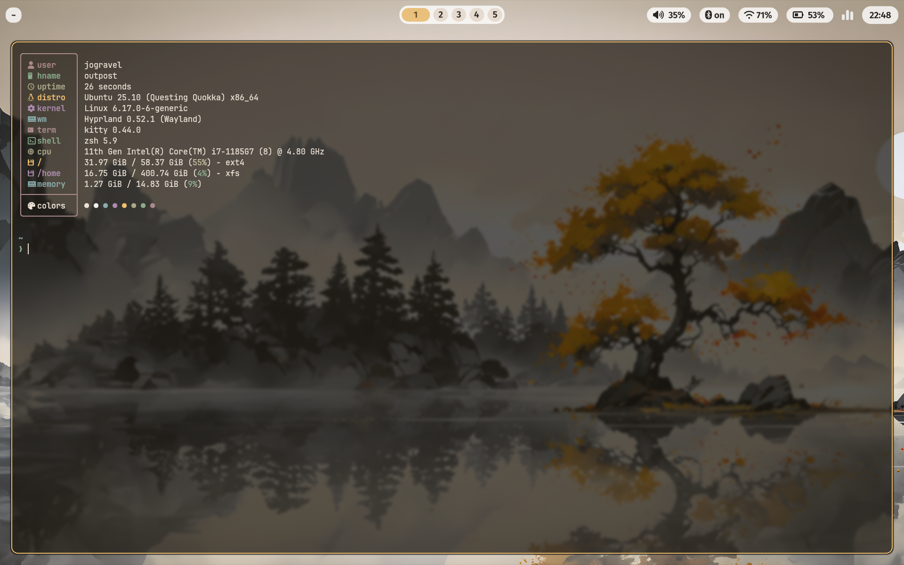

# Dotfiles

Powered by Nix Home Manager.

## Instructions

```bash
git clone git@github.com:yobiscus/dotfiles.nix ~/.dotfiles
cd ~/.dotfiles
git submodule update --init
```

**Ubuntu:**

```bash
~/.dotfiles/ubuntu-init.sh
```

**macOS:**

Some nix modules are not compatible with macOS (haven't looked into it). Use
homebrew for package management. The `mac-init.sh` script just creates
symlinks.

```bash
~/.dotfiles/mac-init.sh
```

## Screenshot


